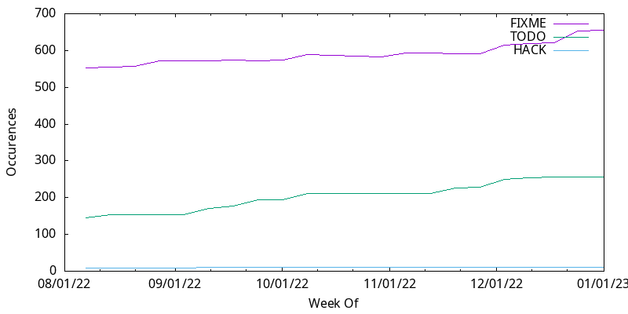

# Code Health And Reporting Tools (CHART)

_How smelly is your code base?_

This project is a set of (very simple) [recipes](bin/coveragetrack.zsh) for
tracking the health of your code base (geared presently for Clojure but easily
re-suited for any) in the form of a graph-rich _Health Report_. In comparison,
some tools (eg, [codecov](https://about.codecov.io/)) already exist to aid
with seeing your code health in a small specific area (test coverage). But
CHART is a collection of various metrics worth tracking with a more flexible
DIY approach, _over time_. The _Smellables_ (trackable code smell indicators)
are up to you, but likely candidates include:

- docstring coverage (long, too-short, missing; via grep)
- unit test coverage (eg, [cloverage](https://github.com/cloverage/cloverage))
- FIXME/TODO/etc occurrences (raw counts via grep)
- deprecations (usages, occurrences; grep and metadata markers)
- namespace dependency depth/magnitude
  ([lein-ns-dep-graph](https://github.com/hilverd/lein-ns-dep-graph) and grep)
- function purity/testability (eg, add metadata `^:pure` markers, via grep)
- naming consistency (namespace aliases, etc; [misaliased, WIP](https://github.com/MicahElliott/Misaliased))
- out-of-date libraries (eg, [antq](https://github.com/liquidz/antq))

Each of those (may have multiple indicators and) becomes a section in ...

## ⚕️ The Health Report

You'll want to have an actionable, updating report that illuminates the weak
spots in your code base. See the **[example Health Report](example/codehealth.md)**
_(TAKE A LOOK NOW!!)_ for a model to emulate. The Health Report can be shared
with your team on a weekly basis to celebrate your progress (or highlight a
problem), now that you've identified some Smellables (areas for improvement).

With the report in place, you're ready to explain your situation to the
stakeholders:

- _Fellow devs_: can start taking pride in fixing and creating healthy code
- _Product_: will realize the need to allot time for tech-debt
- _Dev managers_: will find peace of mind in seeing quality improve
- _CTO_: can explain to company/customers that quality is quantified/prioritized

## 🥅 The Goal

**The _Goal_ is to reduce the report down to nothing.**

You'll notice that the example report does not have a _Linting_ section.
That's because the team has already completed their goal for a violation count
target of zero (and configured the violations they don't care about to be
ignored). Linting is a nice one to get to zero so that a _zero-lint policy_
can be enforced through CI.

## 🛠️ Process

It is assumed that your code is managed by `git`. This is to be able
to do historic checkouts to establish a baseline of metrics (though the
historic baseline is optional).

1. Start by creating your own report template with some things you want to try
   tracking (copy from [example report](example/codehealth.md)). You could
   just use
   [clj-kondo in "missing-docstring" mode](https://github.com/clj-kondo/clj-kondo/blob/master/doc/config.md#enable-optional-linters)
   as a starting point to see that your code documentation is severely
   lacking.

1. Then, one-time, run the scripts in "init" mode. (hand-tweak)

1. On a weekly basis, you manually run the scripts to generate a new
   weekly row in each of the TSVs. Or you could make this part of a weekly CI
   flow.

1. Present the report to your dev team to discuss what the priorities are for
   addressing the exposed shortcomings

1. Present those priorities to your Product team to justify that there is
   important tech-debt to be considered in order to keep new features rolling
   out the door!

1. Create a new story for each category, with a chosen percentage improvement,
   and add to the work to the roadmap

## 👩‍🍳Creating a Smellable recipe

Some Smellables are generated from sophisticated tools (eg, cloverage,
[clj-kondo](https://github.com/clj-kondo/clj-kondo/blob/master/doc/config.md#enable-optional-linters),
etc). For these, you need to:

- tell them what indicators you want to see (or use their defaults)
- gather their outputs
- aggregate the output into single numbers
- print the aggregates as a new week-row in a TSV
- create/run a gnuplot of the TSV

Other Smellables are ad hoc, and often a matter of grepping and counting. Each
Smellable section should result in ~4 files:

- `foo.sh` script to generate a new TSV row
- `foo.tsv` to track the metrics (one or several) over time
- `foo.gnguplot` with a few basic configs for how to draw the lines
- `foo.png` as an output from [gnuplot](http://www.gnuplot.info/) to embed in the report

The beauty of these is that there is very little code involved in generating
the data and graphs, yet they are very high-value data. Please submit an issue
here if you come up with other ideas for Smellables.

### Example

Say you want to track the number of `FIXME` and `TODO` comments. Then you just
do a `grep -r 'FIXME' src/some_area_of_interest | wc -l` for the code you
wish to track. There is a working example included (as shown here is too
simplistic).

Each Smellable is its own TSV file. Each indicator should be printed as a row
like:

```shell
# echo "FIXME\tTODO"
nfixmes=$(grep 'FIXME' src/some_area_of_interest | wc -l)
ntodos=$(grep 'TODO' src/some_area_of_interest | wc -l)
...
echo "$week\t$nfixmes\t$ntodos" >> $fixmesfile
````

The [resulting TSV](example/fixmes.tsv) ends up looking like:

```tsv
WEEK	FIXME	TODO	HACK	XXX
2022-08-07	553	146	9	5
2022-08-14	555	154	9	5
2022-08-21	556	153	9	5
```

Then you'll want a simple gnuplot description of the graph you want to plot.
Again, [examples](example/fixmes.gnuplot) are included. A graph will end up
looking something like:



## 📅 Tracking over time

To create the initial data, code is checked out at several points in time
historically. For each checkout, analyses are run. Those analyses are
presently some widely used tools like clj-kondo, plus ad hoc greps, etc.

Then each week someone (or CI) created a new row in each TSV, and the gnuplots
are re-run. You can post the week's new report to a team dev channel.

As of right now, the script(s) are not robust or flexible. I just hand-edit
sections and run till all the functions I care about are called.

## 👮🏽‍♂️Ongoing enforcement

Some Smellables, once reduced to zero (or for newly added code), can be
enforced. For example, Kondo returns a non-zero exit status if it detects
violations. Your CI can be set to reject a build if such tools are non-zero.
This is often followed similarly with code-formatting checkers (eg,
[cljfmt](https://github.com/weavejester/cljfmt)).

You can follow that pattern with your ad hoc scripts to disallow commits that
violate the cleanliness you seek. For example, you could write a "checker"
that scans your whole code base (or just the files that have changed) for new
public functions with an AWOL docstring.

Other Smellables are not necessarily enforceable: if someone notices some
smelly code that's been hanging around, it's probably not her job to fix it on
the spot. So adding a `FIXME` or `^:deprecated` marker should be encouraged.
However, the _use_ of a deprecated function _can_ be disallowed by a linter
check.

One of my favorite checks is enforcing that new functions are documented. The
checker simply looks for the presence of a docstring, and rejects the commit
or build, informing that the new function must either have a docstring, or be
made private -- both being things that are easy to forget.

## ⚠️ Caution

_You're going to piss people off with this._

Many coders don't like you pushing your favorite rules onto them. It is
almost always better for your code base to have a set of rules (documentation,
style, privatization, etc), but many won't realize they're committing
violations until the CI checker you introduced blocks them from finishing
their feature work. You probably want to let a manager introduce the
importance of a new checker/enforcer before you put it into play.

Some more controversial Smellables:

- line length
- spelling mistakes in docstrings
- cyclomatic complexity (function length, etc)
- commit message (format, length, markers, spelling)
