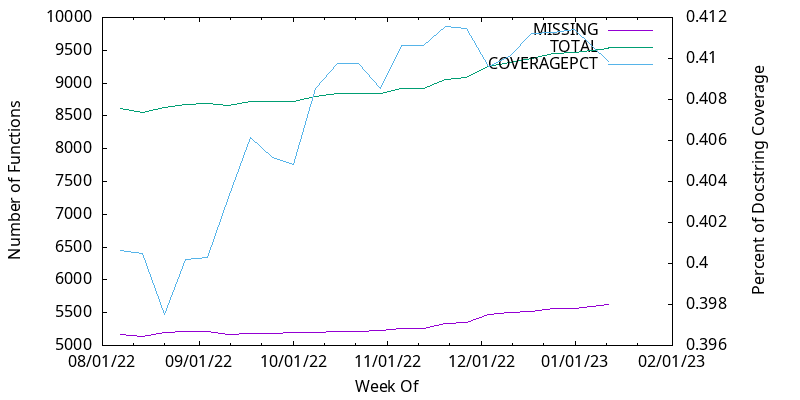
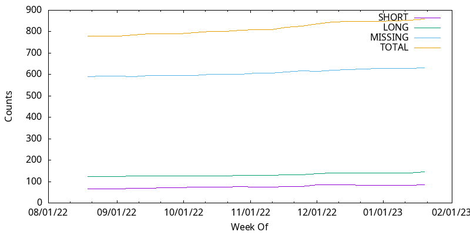

# Code Health Report

The health of this code base is tracked over a weekly timeframe as a growing
set of metrics:

- docstring coverage
- unit test coverage
- FIXME occurrences
- deprecations
- namespace dependency depth/magnitude
- function purity/testability
- naming consistency

## Docstring Coverage

We should document the majority of our namespaces and public functions.

### Function Docstrings

(_TODO_ Identify the private fns and subtract from the total count)

We should continue to:

- add docstrings to our public functions
- identify functions that are only used within an NS and mark them private
- move private (or public) fns into different NSs that are marked as such

**GOAL**: 90% coverage of public functions

### NS Docstrings

Namespace docstrings describe the purpose of the NS as a whole. They can
include: a paragraph or two of descriptions, background, and links to more docs.
SHORT one-line NS docstrings describing purpose are helpful but usually
insufficient; we'd like to grow these too (to be LONG).

**GOAL**: 95% coverage of Namespaces (get the LONG line close to the TOTAL line**

## Kondo Linting

**DONE!** Way to go team!! This is now enforced through CI.

## Unit Test Coverage

(_TODO_ Micah needs to get cloverage working on his system to experiment with
this.)

We should identify functions that amenable to testing and start tracking
coverage of those.

**GOAL**: 50% test coverage

## FIXMEs, TODOs, deprecations, etc

We use `FIXME`, `TODO`, and a bit of `HACK` tags to mark areas of code that
need attention. We also leverage kondo to inform us of use of deprecated
functinos. Growth of these indicates that we are spotting problems but not
addressing them.

To improve, we can:

- continue identifying problems in code and mark them
- set aside time to improve code needing help

**GOAL**: Reduce total counts to under 100

## Pure Functions

We have discusseed identifying "pure" (side-effect free) functions with
metadata markers. Constructing functions that are pure brings many benefits,
including being testability.

To address, we can:

- create sub-NSs that are strictly pure
- refactor to pull side-effects out of functions and isolate
- name non-pure functions according to their side-effect or a simple marker

(_TODO_ Identify and track pure fn counts)

## Dependency Hell

We have an (unnecessarily) excessive number of interdependencies among our NS
requires. To reduce the risk of cyclic dependency errors and unwanted
complexity, we can:

- extract more functions into higher level NSs
- leverage clj 1.11's `as-alias` to require fewer per NS

Dependencies can be seen (and hopefully counted) by running: `lein ns-dep-graph`

## Outdated Libs

Try out and keep track with `antq`.

## Namespace Alias Inconsistencies

(_TODO_ Micah has some tooling to identify and suggest a name for each NS;
record some metrics here)
